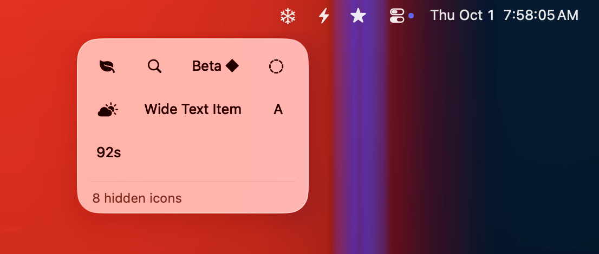
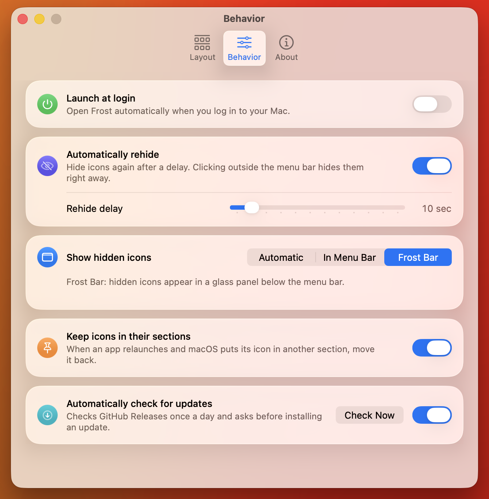

<p align="center">
  
</p>

<h1 align="center">Frost</h1>

<p align="center">
  <a href="https://github.com/frostbar/frost/actions/workflows/ci.yml"></a>
</p>

<p align="center">
  A menu bar manager for macOS 26 Tahoe, built with Liquid Glass.
</p>

<p align="center">
  
</p>

---

Frost hides the menu bar items you rarely use and brings them back with one click, either right in the menu bar or
in the **Frost Bar**, a glass panel that drops down below the menu bar. It works like the open-source
[Ice](https://github.com/jordanbaird/Ice), rebuilt for macOS 26.

## Features

- **Three sections**: Visible, Hidden and Always Hidden. Click the snowflake to show the hidden items; ⌥-click to
  show the always-hidden ones too. Items can hide again automatically after a delay.
- **Frost Bar**: hidden items in a grid below the menu bar. Hover for the app name, click to open the item's menu.
  Item images refresh every second while the panel is open, so temperature or network-speed items stay current.
  Used by default on Macs with a notch; choose **Automatic**, **In Menu Bar** or **Frost Bar** in
  **Settings → Behavior**.
- **Layout editor**: live images of every menu bar item in three bands. Drag items between sections and Frost moves
  them in the real menu bar.
- Permission onboarding, launch at login, multiple displays, automatic updates.
- Available in English and Simplified Chinese (follows your macOS language).

Hiding and showing items needs **no permissions**. Only the Frost Bar and the layout editor do.

## Screenshots

| Layout editor | Behavior settings |
| --- | --- |
|  |  |

## Requirements

macOS 26 Tahoe or later (Apple silicon or Intel). Earlier macOS versions are not supported.

## Install

1. Download `Frost-<version>.dmg` from [Releases](https://github.com/frostbar/frost/releases/latest).
2. Open it and drag **Frost** to **Applications**.
3. Open Frost. It is signed with the project's own certificate but **not notarized by Apple**, so the first launch is
   blocked with "Frost Not Opened". Click **Done**, then open **System Settings → Privacy & Security**, scroll to
   **Security**, click **Open Anyway** next to "Frost was blocked…", confirm with your password and click
   **Open Anyway** again.

   Alternatively, in Terminal: `xattr -dr com.apple.quarantine /Applications/Frost.app`

You only do this once. Updates installed through Frost don't need it, and your permissions stay granted because every
release is signed with the same certificate. Install by dragging in Finder: a copy made another way (e.g. `cp` from the
disk image) runs from a temporary read-only location and can't update itself until you run the `xattr` command above.

## Permissions

| Permission | Used for | Without it |
| --- | --- | --- |
| Accessibility | Identifying which app owns each item; moving items between sections (synthesized ⌘-drags); clicking items in the Frost Bar | The Frost Bar and layout editor ask for the missing permission; hiding and showing still work |
| Screen Recording | Capturing images of menu bar items for the Frost Bar and the layout editor | Same as above |

Onboarding opens on first launch and can be reopened from **Settings → About**. Frost must be relaunched after
granting Screen Recording; onboarding has a button for it.

## Updates

Frost checks for updates once a day with [Sparkle](https://sparkle-project.org) and asks before installing anything.
Check manually with **Check for Updates…** in the snowflake's right-click menu, or turn off **Automatically check for
updates** under **Settings → Behavior**. Updates are verified with an EdDSA signature before they are installed.

## Privacy

- No analytics, no accounts. The only network access is the update check: Frost downloads `appcast.xml` (and an
  update, if you accept it) from this repository's GitHub Releases.
- Menu bar item images are used only for display and cached locally in `~/Library/Caches/dev.frost.Frost/items/`
  (one PNG per item; entries not seen for 30 days are removed). You can delete the folder at any time.

## Build from source

Requirements: Xcode 27 (Swift 6.4), [XcodeGen](https://github.com/yonaskolb/XcodeGen) and OpenSSL 3
(`brew install xcodegen openssl`).

```sh
./scripts/create-signing-cert.sh   # once: creates the self-signed "Frost Local Signing" identity
make build                         # Debug build: build/DerivedData/Build/Products/Debug/Frost.app
make test-core                     # unit tests (Swift Testing)
```

A stable signing identity keeps macOS from asking for permissions again after every rebuild. If `codesign` reports
that the certificate is not trusted, open Keychain Access → "Frost Local Signing" → Trust → Code Signing: Always
Trust. Frost moves and clicks menu bar items, so GUI testing happens in a macOS VM
([`docs/testing-vm.md`](docs/testing-vm.md)); releases are described in [`docs/releasing.md`](docs/releasing.md).

## Known limitations

- On multiple displays Frost manages the menu bar of the active display (the one whose menu bar you last clicked);
  the other displays show system-maintained copies of it.
- Items hidden under the notch can't be captured. Frost shows the app icon (or a cached image) instead, and the menu
  bar briefly collapses while such an item is moved.
- No global hotkeys, hover or scroll triggers, menu bar styling or item search yet.

## License

[MIT](LICENSE). Frost's approach (pushing items off screen with wide separator items) follows
[Ice](https://github.com/jordanbaird/Ice); updates use [Sparkle](https://sparkle-project.org).

