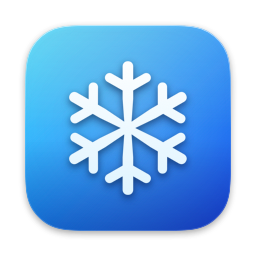
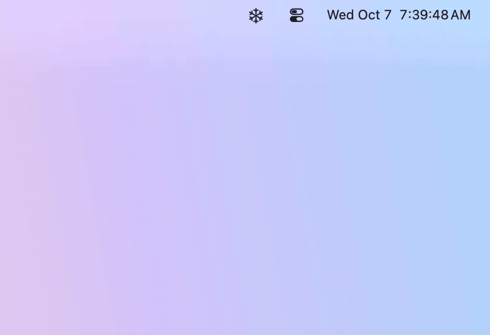
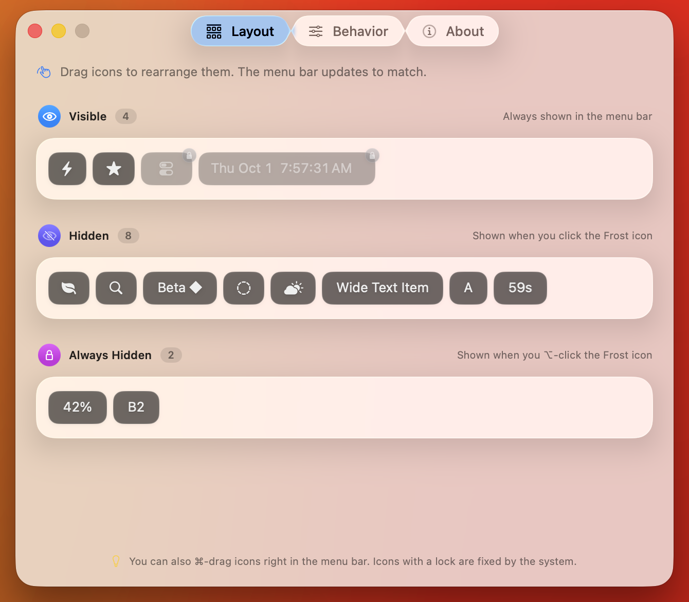
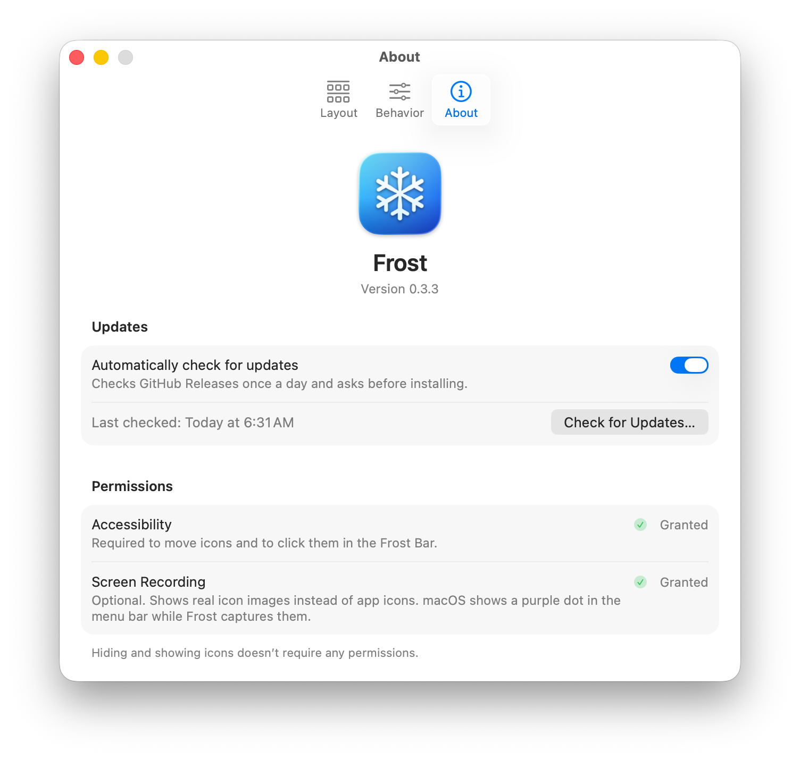

<p align="center">
  
</p>

<h1 align="center">Frost</h1>

<p align="center">
  <strong>A menu bar manager for macOS 26 Tahoe, built with Liquid Glass.</strong><br>
  Hide the menu bar icons you rarely use. Bring them back with one click.
</p>

<p align="center">
  <a href="https://github.com/frostbar/frost/releases/latest"></a>
  
  
  <a href="https://github.com/frostbar/frost/actions/workflows/ci.yml"></a>
  <a href="LICENSE"></a>
</p>

<p align="center">
  
</p>

## Why Frost

- **Made for the notch.** On a MacBook with a notch, icons that don't fit simply disappear behind it. Frost keeps
  them in the **Frost Bar**, a glass panel that drops down below the menu bar, and opens any of them with one click.
- **Feels native.** Liquid Glass, smooth animations, no flicker, English and Simplified Chinese.
- **Stays out of your way.** No accounts, no analytics, no pop-ups. Open source under the MIT license.

## Features

- **Three sections:** Visible, Hidden and Always Hidden. Click the snowflake to show Hidden; ⌥-click to show Always
  Hidden too. Optionally hide them again after a delay. On macOS 27 the menu bar itself decides how many icons fit,
  so the sections are the arrangement you set rather than a boundary Frost reads back (see
  [Known limitations](#known-limitations)).
- **Frost Bar:** hidden icons in a grid with live images (clocks and network speeds stay current). Click an icon to
  open its menu; right-click or Control-click for its secondary menu; ⌥-click to send an Option click.
- **Layout editor:** drag icons between sections using live images of your real menu bar.
- **Keep icons in their sections:** new apps' icons go to Hidden, and when an app relaunches and macOS puts its icon
  somewhere else, Frost moves it back. (macOS 26: on macOS 27 the menu bar decides how many icons fit, so Frost keeps
  the sections you set instead of moving icons back.)
- **Display modes:** Automatic (the Frost Bar on displays with a notch, in the menu bar elsewhere), In Menu Bar, or
  Frost Bar.
- **Multiple displays, launch at login, automatic updates** with a quiet reminder dot instead of pop-ups.

Hiding and showing icons needs **no permissions**. The Frost Bar and the layout editor need only **Accessibility**;
Screen Recording is optional and shows real images of the icons.

| Settings → Layout | Settings → About |
| --- | --- |
|  |  |

## Install

Requires **macOS 26 Tahoe** or **macOS 27** (Apple silicon or Intel). macOS 27 rebuilt the menu bar, so Frost drives it
through a different backend there (see [Known limitations](#known-limitations) for what differs).

1. Download **`Frost-<version>.dmg`** from the [latest release](https://github.com/frostbar/frost/releases/latest).
2. Open it and drag **Frost** to **Applications** in Finder.
3. Open Frost. It's signed with a Developer ID and notarized by Apple, so it opens like any other app; onboarding then
   asks for Accessibility (and, optionally, Screen Recording; see below).

Install by dragging in Finder: a copy made another way (e.g. `cp` from the disk image) runs from a temporary read-only
location and can't update itself.

<details>
<summary><strong>Upgrading from 0.1.x</strong></summary>

0.2.0 is the first release signed with a Developer ID, so macOS asks once more for Accessibility and Screen Recording
after the update. If a switch in **System Settings → Privacy & Security** looks on but Frost still asks, remove the old
Frost entry and grant it again. Later updates keep the permissions.

</details>

## Permissions

| Permission | | Used for | Without it |
| --- | --- | --- | --- |
| Accessibility | Required | Identifying each icon and the app that owns it; moving icons between sections; opening them from the Frost Bar; keeping icons in their sections. On macOS 27 it is also what Frost reads the menu bar with, since there is no window list there (and without it the Frost Bar and layout editor have no icons to show, while hiding and showing still work) | The Frost Bar and layout editor ask for it; hiding and showing still work (hidden icons expand in the menu bar) |
| Screen Recording | Optional | Real images of the icons in the Frost Bar and the layout editor, kept current while the Frost Bar is open. On macOS 27 the images are lifted out of a capture of the menu bar itself, so an icon the bar isn't drawing at that moment keeps its app icon | Everything still works; icons are shown as their app's icon (or a system symbol), with a short label where it helps tell them apart |

Onboarding opens on first launch. **Settings → About** shows each permission's status, and **Grant Access** asks for
it right away (the system prompt, or System Settings if there is no prompt). Without Screen Recording, the Frost Bar
and the layout editor offer it in a small hint you can close. Frost has to be relaunched after granting Screen
Recording: a **Relaunch** button (next to **Open System Settings**) appears right where you granted it, and Frost
reopens the window you were in.

## Updates and privacy

- Frost checks for updates once a day with [Sparkle](https://sparkle-project.org) and installs nothing without asking.
  When an update is available, a dot appears on the snowflake and its right-click menu shows **Update Available…**.
  You can check manually (**Settings → About** also shows when Frost last checked) or turn automatic checks off
  there. Updates are verified with an EdDSA signature.
- The update check is Frost's only network access: it downloads `appcast.xml` (and the update, if you accept it) from
  this repository's GitHub Releases. No analytics, no accounts.
- Menu bar icon images are used only for display and cached in `~/Library/Caches/dev.frost.Frost/items/` (entries not
  seen for 30 days are removed). You can delete the folder at any time.

## Known limitations

- **macOS 27 works differently.** It draws the whole menu bar in one system process, so Frost reads the icons through
  Accessibility, hides them by the *space* two of its own invisible dividers take up (not by pushing them off screen
  like macOS 26), and moves an icon with a ⌘-drag that starts on the icon itself. Two consequences you will notice:
  how many icons the menu bar draws for a given divider width depends on what is in your bar, so Frost never claims
  which icons are hidden; and the layout editor's sections are the arrangement you set there rather than something
  read from the bar. Without Screen Recording the Frost Bar lists your icons with their app icons instead of captured
  images, and it doesn't say how many of them are hidden. On a macOS version Frost hasn't been measured on it leaves the menu bar
  alone and says so in its menu and in Settings → About.
- With several displays, Frost manages the menu bar you last clicked; the other displays show macOS's copies of it.
- macOS doesn't draw icons behind the notch, so Frost gets their images with a short background capture: while you
  aren't using the menu bar, it moves one such icon next to the snowflake under a still image of the menu bar and puts
  it straight back (with Screen Recording granted). Until then they show their app icon, and images that change (a
  timer, a temperature) are only refreshed occasionally. The menu bar also briefly collapses while such an icon is moved in the layout editor.
- Frost has no global hotkeys, hover or scroll triggers, menu bar styling, or icon search.

## Build from source

Requires Xcode 27 (Swift 6.4), [XcodeGen](https://github.com/yonaskolb/XcodeGen) and OpenSSL 3
(`brew install xcodegen openssl`).

```sh
./scripts/create-signing-cert.sh   # once: a self-signed "Frost Local Signing" identity for Debug builds
make build                         # Debug build: build/DerivedData/Build/Products/Debug/Frost.app
make test-core                     # unit tests (Swift Testing)
make install                       # Release build (Developer ID if you have one), installed to /Applications
make ci-build                      # unsigned universal Release build, as run by CI
```

A stable signing identity keeps macOS from asking for permissions after every rebuild. If `codesign` says the
certificate isn't trusted, open Keychain Access → "Frost Local Signing" → Trust → Code Signing: Always Trust.

Frost moves and clicks real menu bar icons, so GUI testing happens in a macOS VM ([`docs/testing-vm.md`](docs/testing-vm.md)).
Releases are described in [`docs/releasing.md`](docs/releasing.md); contributor notes are in [`AGENTS.md`](AGENTS.md).
Found a bug? [Open an issue](https://github.com/frostbar/frost/issues/new/choose).

## Acknowledgements

Frost's approach (pushing icons off screen with wide separator items) follows the open-source
[Ice](https://github.com/jordanbaird/Ice). Updates use [Sparkle](https://sparkle-project.org).

## License

[MIT](LICENSE)
